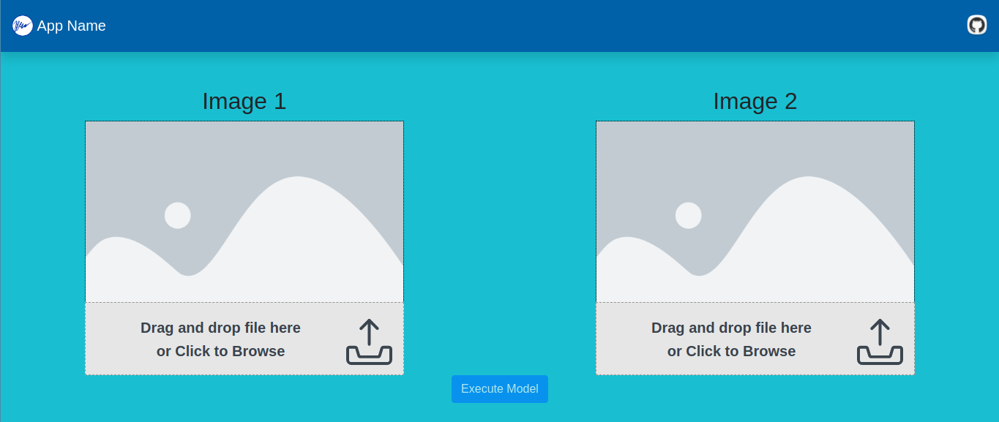

# Computer-Vision-Model-Demo-Template

# Web Application Screenshot

# Assumptions before Proceeding

* You already have a trained Keras / PyTorch / SKLearn or any other model with you.
* You want to deploy this model using Python backend and Angular front-end
* If your plan for this demonstration matches the Overview mentioned below

# Overview

This template will work for developers if the following use case sequence matches their plan:

* End-user visits webpage
* He sees 1/2 placeholders for uploading images on which he wants to get some output depending on the application's purpose
* He uploads 1/2 images by dragging and dropping them in the respective drop boxes or by clicking on the boxes for selecting images
* He clicks the button to view the output

# Example Website

Example Website that is using this template:

[VeriSign](https://veri-sign.web.app/)

# Back-End

The ML/DL model is called from a backend Python Flask Server. You could extend the single file script mentioned here - [server.py](https://github.com/kartik2112/Computer-Vision-Model-Demo-Template/blob/master/server.py) to meet your purpose. You could test this server by executing:

`python server.py`

We can deploy this server on Heroku which supports Python Flask Servers. The article [Deploying a Flask Application to Heroku](https://stackabuse.com/deploying-a-flask-application-to-heroku/) details this procedure of deploying the module on Heroku. It mentions the need of 2 configuration files. Sample configuration files that could be extended in this template are: 

* [Procfile](https://github.com/kartik2112/Computer-Vision-Model-Demo-Template/blob/master/Procfile) which mentions the `gunicorn` command for executing `server.py` Note in this file, 
  `web: gunicorn server:app` server corresponds to the python script `server.py` and `app` corresponds to the name of Flask app in this script.
* [requirements.txt](https://github.com/kartik2112/Computer-Vision-Model-Demo-Template/blob/master/requirements.txt) which mentions the libraries that are needed for execution of `server.py`.

As mentioned in the article, when you execute `git push heroku master`, Heroku will pip install all the libraries mentioned in `requirements.txt`. However in the free version of Heroku, there is a 500 MB limit on the total (slug) size of these libraries as mentioned [Slug Compiler - Slug Size](https://devcenter.heroku.com/articles/slug-compiler#slug-size). So, you would want to limit the number of libraries to the only ones needed for `server.py` execution. As you can see in this `requirements.txt` file I created, a older versions of OpenCV and Tensorflow has been used to ensure that this slug limit is not crossed. 

You could check the reachability of your deployed application by entering `https://app-name.herokuapp.com/ping` in your browser (Assuming you have not deleted the ping endpoint in `server.py`).

# Front-End

You could modify the [Angular Web App](https://github.com/kartik2112/Computer-Vision-Model-Demo-Template/tree/master/Angular%20App/SignatureVerify) according to your application. 

You might need to update the following items mainly:

* `Angular App/SignatureVerify/src/index.html`: Change the favicon and page title
* `Angular App/SignatureVerify/src/app/app.component.html`: Placholder Images and corresponding texts
* `Angular App/SignatureVerify/src/app/app.component.ts`: Server URL and appropriate response processing

The server can be tested by changing directory to `./Angular App/SignatureVerify` and first executing `npm install` followed by `ng serve --open`.

After the results are satisfactory, you can proceed to deploying this on Firebase as mentioned in the article: [Deploying an Angular App to Firebase Hosting](https://alligator.io/angular/deploying-angular-app-to-firebase/). 

As mentioned in the article, to deploy your application, execute `ng build --prod`. You need to configure your folder so that you can deploy your latest build to Firebase using `firebase login`, `firebase init` (Mention `dist/AppName` depending on the folder created in dist subfolder). After this you can deploy your application to Firebase server using `firebase deploy`.

# Limitations

During the creation of this template, latest Angular version available was 9.x.x but one of the dependencies `ng2-img-max` was not compatible with the latest version, hence Angular version 8.x.x was installed. If you are directly using this template, you need not worry about this. The [`package.json`](https://github.com/kartik2112/Computer-Vision-Model-Demo-Template/blob/master/Angular%20App/SignatureVerify/package.json) has the appropriate versions mentioned and you can directly execute `npm install` in the root Angular webapp folder.
